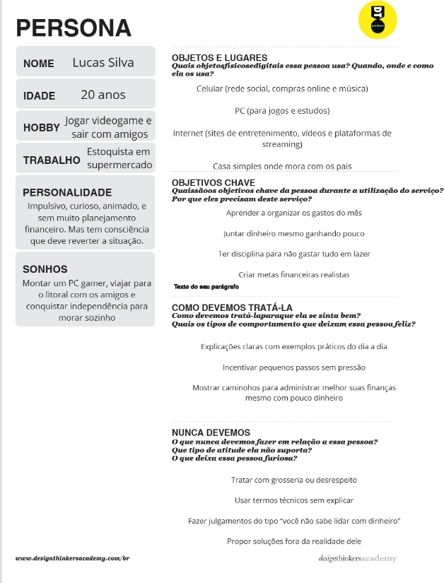
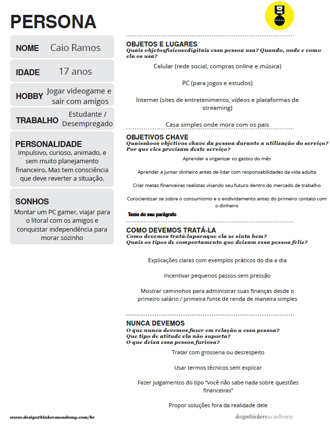

# Introdução

Informações básicas do projeto.

* **Projeto:** [FinAcademy]
* **Repositório GitHub:** [https://github.com/ICEI-PUC-Minas-PPLCC-TI/ti1-g6-educacao-financeira.git]
* **Membros da equipe:**

  * Felipe (https://github.com/felipe19832)
  * Camargo (https://github.com/camargosousa718-ai/ti.git) 
  * Luís Fernando (https://github.com/guimaraesfarialf-cmyk) 
  * Ian Gabriel (https://github.com/Minedfish1) 

A documentação do projeto é estruturada da seguinte forma:

1. Introdução
2. Contexto
3. Product Discovery
4. Product Design
5. Metodologia
6. Solução
7. Referências Bibliográficas


# Contexto

Detalhes sobre o espaço de problema, os objetivos do projeto, sua justificativa e público-alvo.

## Problema

Muitas pessoas enfrentam dificuldade em gerenciar suas finanças pessoais. Há falta de conhecimento sobre planejamento, controle de gastos, investimentos e economia doméstica. Isso leva a decisões financeiras inadequadas, endividamento e dificuldade em alcançar metas financeiras. Apesar de existirem aplicativos e ferramentas, muitos são complexos ou não oferecem suporte educativo para ensinar boas práticas financeiras

## Objetivos

O projeto de educação financeira visa:

Criar uma plataforma ou aplicativo educativo que ensine conceitos básicos de finanças pessoais.

Ajudar o usuário a controlar gastos, registrar receitas e planejar o orçamento de forma prática.

Apresentar relatórios e gráficos educativos, mostrando hábitos de consumo e sugerindo melhorias.

Incentivar tomadas de decisão conscientes, promovendo educação financeira contínua.
 

## Justificativa

A educação financeira é essencial para promover autonomia econômica e bem-estar social. Muitos brasileiros não possuem conhecimento suficiente sobre orçamento, investimentos ou dívidas, o que prejudica sua qualidade de vida. Um projeto que combine controle financeiro com aprendizado ajuda a reduzir endividamento, formar hábitos financeiros saudáveis e preparar o público para decisões financeiras futuras.

 
## Público-Alvo
O público-alvo do projeto de educação financeira inclui:

Jovens adultos e estudantes que estão começando a lidar com finanças pessoais.

Profissionais que buscam organizar orçamento e poupança de forma eficiente.

Pessoas sem experiência prévia em finanças, que necessitam de ferramentas educativas e intuitivas.

Instituições educacionais que desejam inserir conteúdos de finanças pessoais em seus currículos.

# Product Discovery

## Etapa de Entendimento

[Matriz CSD](docs/files/Matriz.pdf)
[Mapa de Stakeholders](docs/files/MapaStakeholders.pdf)
[Entrevista Qualitativa](docs/files/ENTREVISTA QUALITATIVA (1).pdf)
[Highlights](docs/files/Highlights (1).pdf)


## Etapa de Definição

### Personas




# Product Design

Nesse momento, vamos transformar os insights e validações obtidos em soluções tangíveis e utilizáveis. Essa fase envolve a definição de uma proposta de valor, detalhando a prioridade de cada ideia e a consequente criação de wireframes, mockups e protótipos de alta fidelidade, que detalham a interface e a experiência do usuário.

## Histórias de Usuários

Com base na análise das personas foram identificadas as seguintes histórias de usuários:

| EU COMO...`PERSONA` | QUERO/PRECISO ...`FUNCIONALIDADE` | PARA ...`MOTIVO/VALOR` |
| ------------------- | -----------------------------------------------| -----------------------------------|
| Estudante sem experiência | Aprender a organizar meus gastos mensais | Criar uma base financeira sólida antes da vida adulta |
| Jovem trabalhador com renda baixa | Saber como juntar dinheiro e ter disciplina para não gastar tudo em lazer | Alcançar metas financeiras realistas, como morar sozinho |
| Usuário do sistema | Entender melhor como administrar meu dinheiro | Uma melhor vida financeira |


## Proposta de Valor

##### Proposta de valor para Persona Lucas Silva


## Requisitos

As tabelas que se seguem apresentam os requisitos funcionais e não funcionais que detalham o escopo do projeto.

### Requisitos Funcionais

| ID     | Descrição do Requisito                                   | Prioridade |
| ------ | ---------------------------------------------------------| ---------- |
| RF-001 | Permitir que o usuário cadastre seus dados pessoais      | ALTA       |
| RF-002 | Calcular juros Compostos                                 | MÉDIA      |
| RF-003 | Mostar Gráficos baseados na situação financeira          | MÉDIA      |
| RF-004 | Conteúdos Educacionais                                   | ALTA       |

### Requisitos não Funcionais

| ID      | Descrição do Requisito                                                              | Prioridade |
| ------- | ------------------------------------------------------------------------------------| ---------- |
| RNF-001 | Segurança de dados                                                                  | ALTA       |
| RNF-002 | Uso de API para bancos                                                              | MÉDIA      |
| RNF-003 | Deve ser Responsivo                                                                 | BAIXA      |
| RNF-004 | Visual Limpo                                                                        | BAIXA      |


## Projeto de Interface

Artefatos relacionados com a interface e a interacão do usuário na proposta de solução.

### Wireframes

##### TELA QUIZ
Quiz para treinar conhecimentos adquiridos


##### TELA CONTEUDOS
Conteúdo para aprender e se conscientizar a respeito de temas do mundo financeiro


##### TELA MENU
Menu principal para naver pelo site


##### TELA PERFIL ECONOMICO
Pop-UP para cadastrar dados que influenciarão em sua experiência no site


##### TELA RESULTADOS DO PERFIL ECONOMICOP
Pop-UP para mostrar resultados do questionário


##### TELA CALCULAR JUROS
Calculadora de juros compostos e gráficos para mostrar resultados


##### TELA GESTAO DE RISCO E RECOMENDAÇÕES
Risco relacionado ao tipo de investimento e recomendações de como seria esse mesmo valor reinvestido em outro lugar


Estes são os protótipos de telas do sistema.

### User Flow


### Protótipo Interativo

[Protótipo Interativo (Figma)](https://www.figma.com/make/KPPN8zkGTr9q6j89hvpLDs/Interactive-Website?node-id=0-1&p=f&t=kgFnxxIlhVjDLOkE-0)


# Metodologia

Detalhes sobre a organização do grupo e o ferramental empregado.

## Ferramentas

Relação de ferramentas empregadas pelo grupo durante o projeto.

| Ambiente                    | Plataforma | Link de acesso                                 |
| --------------------------- | ---------- | -----------------------------------------------|
| Processo de Design Thinking | Canva      | [Link para o Board de Design Thinking] |
| Repositório de código       | GitHub     | https://github.com/ICEI-PUC-Minas-PPLCC-TI/ti1-g6-educacao-financeira.git  |
| Hospedagem do site          | GitHubPages| [Link para o GitHub Pages] |
| Protótipo Interativo        | Figma      | https://www.figma.com/make/KPPN8zkGTr9q6j89hvpLDs/Interactive-Website?node-id=0-1&p=f&t=kgFnxxIlhVjDLOkE-0 |
|                             |            |                                                |


## Gerenciamento do Projeto

Divisão de papéis no grupo e apresentação da estrutura da ferramenta de controle de tarefas (Kanban).


# Solução Implementada

Esta seção apresenta todos os detalhes da solução criada no projeto.

## Vídeo do Projeto

O vídeo a seguir traz uma apresentação do problema que a equipe está tratando e a proposta de solução.

[](https://www.youtube.com/embed/SEU_LINK_DO_VIDEO)

## Funcionalidades

Esta seção apresenta as funcionalidades da solução.Info

##### Funcionalidade 1 - Módulos de Conteúdo Educacional

Apresenta uma série de módulos e tópicos sobre educação financeira, como Diagnóstico Financeiro, Orçamento, Dívidas, Reserva de Emergência e Investimentos (Renda Fixa e Variável).

* **Estrutura de dados:** [Módulos](#modulos) e [Tópicos](#topicos)
* **Instruções de acesso:**
  * Acesse a seção "Conteúdo" no menu principal.
* **Tela da funcionalidade**:


##### Funcionalidade 2 - Calculadora de Juros Compostos

Permite ao usuário realizar simulações financeiras de juros compostos, visualizando o saldo final e os juros ganhos ao longo do tempo.

* **Estrutura de dados:** [Simulações](#simulacoes) e [Histórico Tabela](#historicotabela)
* **Instruções de acesso:**
  * Acesse a seção "Calculadora" no menu principal.
* **Tela da funcionalidade**:


##### Funcionalidade 3 - Quiz Interativo

Avalia o conhecimento do usuário sobre os tópicos de educação financeira através de perguntas de múltipla escolha.

* **Estrutura de dados:** [Questions](#questions)
* **Instruções de acesso:**
  * Acesse a seção "Quiz" no menu principal.
* **Tela da funcionalidade**:


##### Funcionalidade 4 - Perfil Econômico

Permite ao usuário cadastrar dados pessoais de renda, despesas e dívidas para obter um diagnóstico financeiro e recomendações personalizadas.

* **Estrutura de dados:** [Perfil Econômico](#perfileconomico)
* **Instruções de acesso:**
  * Acesse a seção "Perfil Econômico" no menu principal.
* **Tela da funcionalidade**:


## Estruturas de Dados

Descrição das estruturas de dados utilizadas na solução com exemplos no formato JSON.Info

##### Estrutura de Dados - Usuários (usuarios)

Registro dos usuários do sistema utilizados para login e para o perfil do sistema.

```json
  {
    "id": "1",
    "login": "admin",
    "senha": "123",
    "nome": "Administrador",
    "email": "admin@abc.com",
    "perfil": "admin"
  }
```

##### Estrutura de Dados - Perfil Econômico (perfilEconomico)

Armazena os dados financeiros do usuário para diagnóstico e recomendações.

```json
  {
    "id": "cf5d",
    "data": "2025-11-19",
    "renda": 1700,
    "fonteRenda": "salario",
    "rendaExtra": "nao",
    "custoFixo": 1200,
    "despesa": 200,
    "dividaMensal": 100,
    "dividaParcelas": 1,
    "rendaMeta": 5000
  }
```

##### Estrutura de Dados - Módulos (modulos)

Define a estrutura dos módulos de conteúdo educacional.

```json
  {
    "id": "1",
    "titulo": "Diagnóstico Financeiro",
    "ordem": 1,
    "descricao": "• Cálculo do Patrimônio Líquido\n• Diferença entre Ativos e Passivos\n• Análise de Fluxo de Caixa Pessoal"
  }
```

##### Estrutura de Dados - Tópicos (topicos)

Define os tópicos de conteúdo dentro de cada módulo.

```json
  {
    "id": "101",
    "modulo_id": "1",
    "titulo": "1.1 O que é Diagnóstico Financeiro?",
    "corpo": "<p>É o raio-x da sua vida financeira. Antes de investir, você precisa saber quanto ganha, quanto gasta e quanto deve.</p>"
  }
```

##### Estrutura de Dados - Simulações (simulacoes)

Armazena os parâmetros e resultados das simulações de juros compostos.

```json
  {
    "id": 1,
    "data": "2025-11-24T10:30:00-03:00",
    "principal": 1000,
    "taxaAnual": 5,
    "anos": 5,
    "frequencia": 12,
    "frequenciaTexto": "Mensal",
    "saldoFinal": 1283.36,
    "jurosGanhos": 283.36,
    "descricao": "Simulação padrão de exemplo"
  }
```

##### Estrutura de Dados - Histórico Tabela (historicoTabela)

Armazena o histórico anual de saldos para visualização gráfica das simulações.

```json
  {
    "simulacaoId": 1,
    "dadosAnuais": [
      { "ano": 1, "saldo": 1051.16 },
      { "ano": 5, "saldo": 1283.36 }
    ]
  }
```

##### Estrutura de Dados - Perguntas (questions)

Armazena as perguntas e respostas para o Quiz Interativo.

```json
  {
    "id": "2",
    "question": "Em finanças pessoais, o que é a 'Reserva de Emergência'?",
    "options": [
      "Um seguro de vida obrigatório.",
      "Uma quantia de dinheiro guardada para cobrir despesas inesperadas (3 a 12 meses).",
      "O limite do seu cartão de crédito.",
      "O saldo da sua conta poupança para aposentadoria."
    ],
    "correct_answer": "Uma quantia de dinheiro guardada para cobrir despesas inesperadas (3 a 12 meses)."
  }
```

## Módulos e APIs

Esta seção apresenta os módulos e APIs utilizados na solução

**Servidor Back-end:**

* **Express.js:** Framework web para Node.js, utilizado para criar o servidor da aplicação.
* **JSON Server:** Biblioteca utilizada para simular uma API RESTful, servindo os dados do arquivo `db.json`.

**Bibliotecas Front-end (Identificadas no código):**

* **jQuery:** Biblioteca JavaScript para manipulação de DOM e simplificação de requisições AJAX.
* **Bootstrap:** Framework de front-end para desenvolvimento responsivo e rápido.
* **Chart.js:** Biblioteca JavaScript para criação de gráficos (utilizada na visualização de simulações).

**APIs/Serviços:**

* **JSON Server API:** Utilizada para persistência e acesso aos dados da aplicação (usuários, perfil econômico, módulos, simulações, etc.). Endereço base: `https://jsonserver.rommelpuc.repl.co/` (conforme `index.js`).

# Referências

As referências utilizadas no trabalho foram:

* [Insira aqui as referências bibliográficas no formato ABNT]